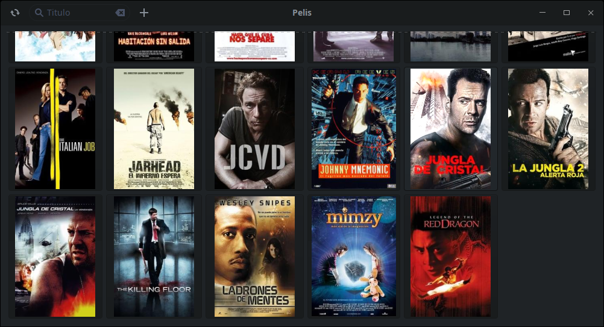

# Base de Datos Películas

base de datos para localizar donde guardo todo lo grabado en cd

- [x] Base de Datos Implementada
- [x] Menú Simple para Terminal
- [x] Añadir descarga de Imágenes (Programa a parte y completa database)
- [x] Crear Gui en GTK

### Info:

para el correcto funcionamiento y descarga de portadas usa la librería ***tmdbv3api***

tmdbv3api necesita una api key por lo que hay que 
registrarse en https://www.themoviedb.org/account/signup 
para conseguirla y después: 

* o bien se añade la linea "base.api_key = 'YOUR_API_KEY'" 
* o se pone como variable del sistema con "export TMDB_API_KEY='YOUR_API_KEY'"
* y ahora también puede añadirla al archivo de configuración ~/.config/pelisdb/pelisdb.conf

### Requerimientos:

* pip install PyGObject
* pip install tmdbv3api
* pip install toml
* pip install Pillow
