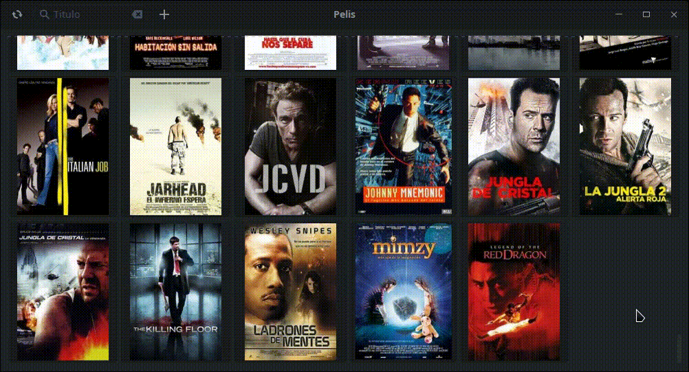

# PelisDB

PelisDB es una sencilla aplicación de escritorio para Linux que te permite gestionar tu propia base de datos de películas. Creada con Python y GTK3.



## Características

*   **Visualización de carátulas**: Navega por tu colección de películas de forma visual.
*   **Gestión de datos**: Añade, edita y consulta la información de tus películas.
*   **Metadatos automáticos**: Obtiene información de las películas (como el año, la sinopsis, etc.) desde The Movie Database (TMDB).
*   **Selector de Tema**: Incluye un botón para cambiar entre el tema claro y oscuro de la aplicación (dependiente del soporte del tema GTK del sistema).

## Instalación

Para usar esta aplicación, necesitarás Python 3 y las librerías de GTK3 instaladas en tu sistema.

1.  **Clonar el repositorio (o descargar los ficheros)**
    Si has descargado los ficheros, simplemente navega a la carpeta del proyecto.

2.  **Crear un entorno virtual (Recomendado)**
    Es una buena práctica aislar las dependencias del proyecto.
    ```bash
    python3 -m venv .venv
    source .venv/bin/activate
    ```

3.  **Instalar las dependencias**
    Desde la carpeta del proyecto, ejecuta:
    ```bash
    pip install -r requirements.txt
    ```

## Configuración

### API Key de TMDB

La aplicación utiliza la API de [The Movie Database (TMDB)](https://www.themoviedb.org/documentation/api) para descargar los metadatos de las películas. Para que esta función esté disponible, necesitas una clave de API.

1.  Regístrate en la web de TMDB.
2.  Ve a la sección "API" de tu perfil y solicita una clave.
3.  Cuando ejecutes la aplicación por primera vez, se creará un fichero de configuración (`comfiguracion.py` y un `.conf`). Edita el fichero `.conf` y añade tu clave de API en el campo `tmdb_api_key`.

## Uso

Una vez instalado y configurado, puedes ejecutar la aplicación con el siguiente comando desde la carpeta del proyecto (asegúrate de tener el entorno virtual activado si lo creaste):

```bash
python3 maingtk.py
```

## Integración con el Escritorio (Linux)

Para añadir `PelisDB` a tu menú de aplicaciones y lanzarlo como un programa nativo, puedes crear un fichero `.desktop`.

1.  Crea un fichero llamado `PelisDB.desktop` en la carpeta raíz del proyecto.

2.  Pega el siguiente contenido. **Importante:** deberás reemplazar `/ruta/absoluta/a/tu/proyecto/PelisDB` con la ruta real donde has guardado el proyecto.

    ```ini
    [Desktop Entry]
    Version=1.0
    Name=PelisDB
    Comment=Gestor de base de datos de películas
    Exec=/ruta/absoluta/a/tu/proyecto/PelisDB/.venv/bin/python /ruta/absoluta/a/tu/proyecto/PelisDB/maingtk.py
    Icon=/ruta/absoluta/a/tu/proyecto/PelisDB/icono.svg
    Terminal=false
    Type=Application
    Categories=AudioVideo;Video;Database;
    ```

3.  Instala el lanzador en tu sistema copiándolo a la carpeta de aplicaciones locales:

    ```bash
    cp PelisDB.desktop ~/.local/share/applications/
    ```

Tras unos instantes, "PelisDB" debería aparecer en tu menú de aplicaciones.